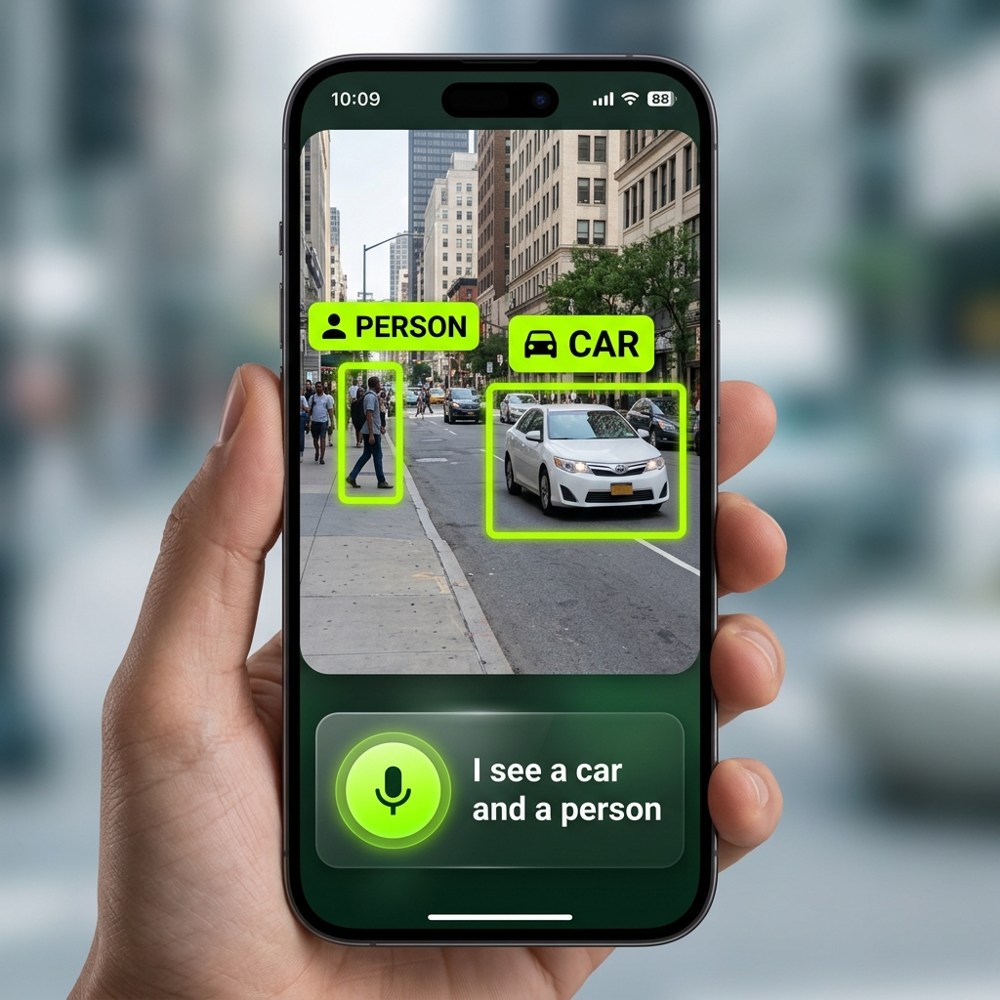
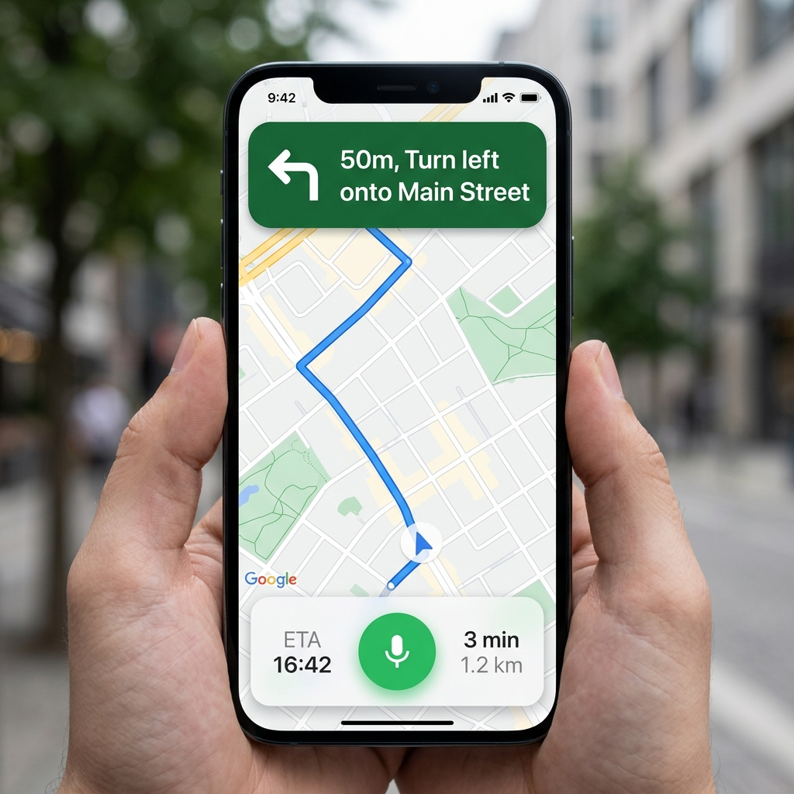
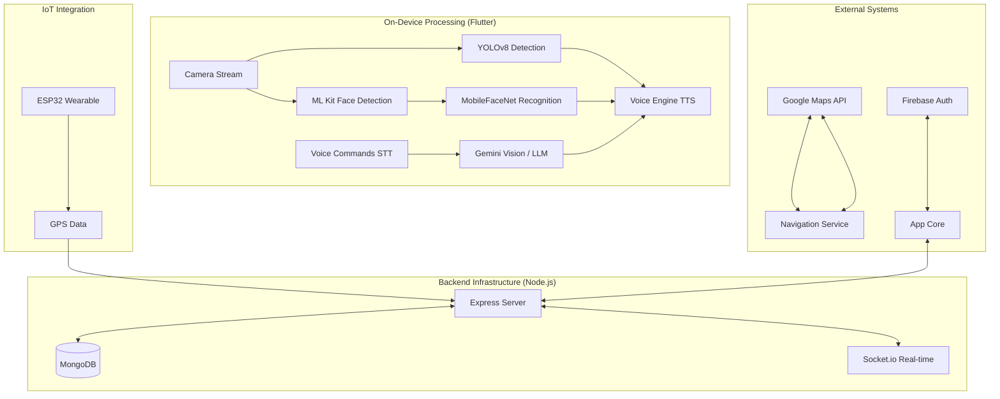

# CogniVision: Advanced Assistive Intelligence 👁️🤖

**Empowering the visually impaired through AI-driven computer vision, smart navigation, and real-time guardian monitoring.**

[](https://flutter.dev)
[](https://nodejs.org)
[](https://www.mongodb.com)
[](https://firebase.google.com)

---

## 📌 One-Line Problem Statement
Visually impaired individuals face significant barriers in independent navigation and environmental awareness, requiring a seamless, real-time integration of AI vision, voice-guided navigation, and remote guardian oversight to ensure safety and autonomy.

---

## 🖼️ System Screenshots

<p align="center">
  
  
</p>

---

## 🛠️ Architecture Diagram



---

## ✅ Feature Implementation Checklist

| Feature | Status | Implementation Detail |
| :--- | :---: | :--- |
| **YOLOv8 Object Detection** | ✅ | On-device inference via TFLite in `lib/features/ai_assistant/yolo_detector.dart` |
| **Face Recognition** | ✅ | ML Kit + MobileFaceNet + Hive in `lib/core/services/face_recognition_service.dart` |
| **Gemini Vision (Scene Desc)** | ✅ | Multimodal Gemini integration in `lib/core/services/gemini_service.dart` |
| **Voice Navigation** | ✅ | Google Maps Polyline integration in `lib/core/services/navigation_service.dart` |
| **Node.js Backend** | ✅ | REST API & Mongoose schemas in `backend/src/index.js` |
| **SOS Alert System** | ✅ | End-to-end trigger in `lib/core/services/command_router.dart` |
| **IoT Firmware** | ✅ | ESP32 + NEO-6M GPS code in `firmware/location.ino` |
| **Test Suite** | ✅ | Meaningful unit & widget tests in `test/` |

---

## 📁 Project Structure

```text
CogniVision/
├── backend/            # Node.js + Express + MongoDB Server
├── firmware/           # ESP32 IoT Location Tracking Code
├── screenshots/        # Application UI Previews
└── frontend/
    └── gemini_live_app/
        ├── lib/
        │   ├── core/           # Shared services (Voice, Vision, Navigation)
        │   ├── features/       # Modular features (Auth, AI, Tracker)
        │   └── routes/         # App routing & navigation
        └── test/               # Unit & Widget tests
```

---

## 🔍 Technical Deep Dive

### 🧠 Vision Pipeline
Our vision system uses a multi-stage processing pipeline optimized for mobile performance:
1. **Object Detection**: YOLOv8n (Nano) running on TFLite processes frames in under 50ms, identifying obstacles like 'cars', 'stairs', or 'poles'.
2. **Face Recognition**: 
   - **Detection**: Google ML Kit identifies face coordinates.
   - **Embedding**: Faces are cropped and passed through a **MobileFaceNet** TFLite model to generate a 192-d feature vector.
   - **Matching**: Cosine similarity is calculated against a local **Hive** database of known contacts.
3. **Scene Description**: When the user asks "Describe the scene", a high-resolution frame is captured and sent to **Gemini 1.5 Flash** for deep multimodal analysis.

### 🎙️ Voice & Command Loop
1. **STT**: `speech_to_text` captures user intent.
2. **Routing**: `CommandRouter` identifies specific intents (navigation, SOS, vision).
3. **LLM Reasoning**: If no specific intent is matched, the query is sent to **Gemini Pro** to provide an intelligent conversational response.
4. **TTS**: `flutter_tts` announces the result with optimized speech rates for accessibility.

---

## 🚀 Future Roadmap & Enhancements
- **Offline YOLO mode**: On-device inference optimization for lower latency and data privacy.
- **BLE Indoor Navigation**: Integration with BLE beacons for precise positioning inside buildings where GPS fails.
- **Haptic Wristband Integration**: Translating navigation cues into vibration patterns for noisy environments.
- **Multi-language TTS support**: Expanding accessibility for non-English speaking users globally.
- **Fall Detection**: Utilizing IMU sensor data on the ESP32 to detect sudden falls and auto-trigger SOS.
- **Community Hazard Mapping**: Crowdsourced reporting of sidewalk obstacles, construction, and broken elevators.
- **Guardian Multi-User Access**: Role-based access for families to monitor a single user simultaneously.
- **Smart Glass Compatibility**: Optimizing the vision pipeline for heads-up display wearables.

---

## 🧪 Testing Coverage
We enforce a high-quality codebase with automated tests:
- **Unit Tests**: Coverage for command parsing, bounding box IoU calculations, and similarity thresholds.
- **Widget Tests**: Verification of critical UI paths like authentication and role selection.

```bash
cd frontend/gemini_live_app
flutter test
```

---

## ⚙️ Setup & Deployment

1. **Backend**:
   - `cd backend`
   - `npm install`
   - Configure `.env` with `MONGODB_URI`
   - `npm start`

2. **Frontend**:
   - `cd frontend/gemini_live_app`
   - `flutter pub get`
   - Create `.env` in `lib/` with `MAPS_API_KEY` and `BACKEND_URL`
   - `flutter run`

---

*Developed with ❤️ by the CogniVision Team for Accessibility Excellence.*
