# CogniVision

CogniVision is an assistive mobile application designed to empower visually impaired individuals by enabling them to navigate outdoor environments safely and independently. The app leverages the smartphone camera and AI-based vision technology to continuously analyze the surroundings, detect obstacles, and deliver real-time audio guidance to the user. By making individuals aware of their environment, CogniVision helps users move confidently through public spaces without relying on external assistance.

## 🎯 Problem Statement
Visually impaired individuals struggle to navigate outdoor environments safely due to limited real-time obstacle detection in existing mobility aids, creating a strong need for an intelligent, audio-guided assistive solution.

## 🏗️ Architecture

```mermaid
graph TD
    A[Visually Impaired User] --> B[Flutter Mobile App]
    C[Guardian/Caregiver] --> B
    D[IoT Layer: ESP32 + NEO-6M] --> E[Firebase Realtime Database]
    E --> B
    B --> F[Backend: Node.js/Express]
    F --> G[Database: MongoDB]
    B --> H[Google AI: Gemini Vision]
    B --> I[Firebase Auth]
```

## 🔍 Project Scope

### IN SCOPE
CogniVision is a Flutter-based assistive mobile application designed specifically for visually impaired individuals to navigate outdoor environments safely and independently. The scope of this project covers the complete development of a mobile application that integrates multiple technologies including artificial intelligence, IoT hardware, cloud services, and real-time communication to deliver a holistic assistive experience.

*   **Real-Time Object Detection**: Using YOLOv8 through the smartphone camera, providing continuous audio alerts about surrounding obstacles to ensure safe movement.
*   **Face Detection and Recognition**: Using Google ML Kit and the MobileFaceNet model, allowing users to identify known individuals in their surroundings.
*   **AI Voice Assistant**: Built on Firebase AI (Gemini), enabling natural user interaction through voice commands and receiving intelligent audio responses.
*   **Outdoor Navigation**: Integrates Google Maps API for real-time turn-by-turn audio navigation, helping users travel independently.
*   **Guardian Navigation**: Allows caregivers or family members to remotely monitor and guide the visually impaired user in real time through the app.
*   **In-App Map Rendering**: Handled using `flutter_map` and `latlong2`, while `geolocator` continuously tracks the user's live location.
*   **IoT Component**: An ESP32 microcontroller paired with a NEO-6M GPS module for precise location tracking.
*   **Cloud & Data**: 
    *   **Firebase Realtime Database**: Seamless data synchronization between the IoT hardware and the application.
    *   **Firebase Authentication & MongoDB**: Secure user account management and persistent data storage.
*   **SOS Alert System**: Integrated to immediately notify pre-configured emergency contacts whenever the user encounters a critical situation.

### OUT OF SCOPE
*   Indoor navigation and mapping using Bluetooth beacons or Wi-Fi-based positioning systems are not covered in this project.
*   Wearable device integration such as smartwatches, smart glasses, or haptic feedback wristbands is not included in the current development plan.
*   Advanced health monitoring features such as fall detection, heart rate tracking, or emergency medical alerts are not part of the current application.

## 🛠️ Technical Stack

| Category | Technology |
| :--- | :--- |
| **APIs** | Google Maps API, http package, url_launcher |
| **Navigation** | flutter_map, latlong2, geolocator |
| **IoT** | ESP32, NEO-6M GPS, Firebase Realtime Database |
| **Emergency** | SOS Alert System |
| **Backend** | Node.js, Express, MongoDB, Mongoose |
| **Vision** | YOLOv8 (TFLite), ML Kit Face Detection, MobileFaceNet |
| **Voice Assistant** | Firebase AI powered assistant (Gemini Flash API) |

## 🚀 Future Enhancements
*   **Smart Glasses Integration**: Can be implemented in future versions, enabling hands-free real-time object detection and navigation guidance delivered directly through the glasses for a more seamless assistive experience.
*   **Enhanced SOS Alert System**: Directly notify emergency contacts with instant notifications and provide a direct communication channel within the app for faster emergency response.

## 📝 Conclusion
CogniVision successfully delivers a comprehensive and intelligent assistive mobile application that empowers visually impaired individuals to navigate outdoor environments safely and independently. Through the integration of multiple cutting-edge technologies, the project achieves its core objective of providing real-time obstacle detection, audio-guided navigation, and emergency assistance within a single unified mobile platform.

The application successfully integrates YOLOv8 for real-time object detection, Google Maps API for turn-by-turn audio navigation, and a guardian navigation feature that allows caregivers to remotely monitor and guide users. The IoT hardware layer comprising the ESP32 microcontroller and NEO-6M GPS module ensures precise real-time location tracking, while Firebase Realtime Database maintains seamless data synchronization between the device and the application. Face recognition powered by Google ML Kit and the MobileFaceNet model adds an additional layer of environmental awareness, and the Firebase AI powered voice assistant enables natural and intuitive user interaction.

The key takeaway from this project is that combining artificial intelligence, cloud computing, IoT hardware, and mobile development can produce a meaningful and impactful solution for individuals with visual impairments. CogniVision demonstrates that technology can bridge the gap between disability and independence, offering users the confidence to move freely in public spaces. The project also highlights the importance of designing assistive technology that is accessible, voice-driven, and responsive to real-world environments, setting a strong foundation for future enhancements and broader deployment.
